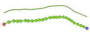

.. _export:

Export to XYZ File Format
*************************

Visualization of particle coordinates is often the first and most intuitive method
to inspect simulation results for any errors, artifacts, or other undesirable outcomes.
For visualizations with external tools, ``actomyosin_analyser`` provides
methods to export particle coordinates to XYZ.
The XYZ file format is a loosely defined data format for particle trajectories
of 3D simulations. For visualization with `ovito <https://www.ovito.org/>`_, the format accepts
more than the typically found 4 columns for particle type and 3 cartesian coordinates.
The ``actomyosin_analyser`` package uses additional columns
to define orientation of cylindrical segments
(rather than using only the coordinates of start and end positions of segments),
to give the displayed filaments a more filamentous look. 
This is demonstrated for one filament in the following figure:

   Identical bead chain configuration in 2 different visualizations using ovito.
   **(Top)** Bead chain drawn as sequence of cylindrical segments, where
   one segment connects two consecutive beads (XYZ file generated with ``actomyosin_analyser``).
   **(Bottom)** The same cylindrical segment visualization overlayed
   with original beads of the bead chain.

For single filaments, both the visualization using beads (coordinates exported to XYZ with default
ReaDDy method) as well as the cylindrical visualization (exported with \ama) are fine. With
crowded simulation boxes, both representations do not carry much information in static images:

.. image:: _static/figures/xyz/bead_chains.png
   :width: 49%
	   
.. image:: _static/figures/xyz/filaments.png
   :width: 49%
	   
However, the filament representation makes it possible to dynamically inspect the
system's state (zoom in, turn camera, select slice of simulation box, etc.) and
see the conformation of individual filaments..

How to Export
=============

The following code snippet is an example how to export trajectories generated with a
`bead-state-model <https://gitlab.com/ilyas.k/bead_state_model>`_ simulation to XYZ:

.. code:: python

   from bead_state_model.data_reader import DataReader
   from actomyosin_analyser import Analyser
   from actomyosin_analyser.file_io.xyz_exporter import XYZExporter
   
   dr = DataReader('simulation/data.h5')
   a = Analyser(dr, 'simulation/analysis.h5')
   
   expo = XYZExporter()
   
   expo.export_all(a, folder='simulation/xyz')
   
The export process is slow (based on for loops over large arrays in pure python).
For large source data files it might take many minutes. One the export process
is done, there will be 3 files in the folder ``simulation/xyz``:
``fibers.xyz, link.xyz, non_filament.xyz``. The first one holds all the polymer
coordinates, the second and third one will only be populated when links (cross-links or motors)
or external particles (i.e. non-filament particles) were used.

Visualize with ovito
====================

Several popular particle visualization softwares exist (e.g. pymol, vmd, ovito).
The output format with polymers drawn as cylindrical segments was developed with
`ovito <https://www.ovito.org/>`_ and the following column mapping in mind:

.. image:: _static/figures/xyz/ovito_column_mapping.png

Use this mapping for the files ``fibers.xyz`` and ``link.xyz``. In addition,
you have to change the particle representation from spheres to cylinders:

.. image:: _static/figures/xyz/ovito_shape_cylinder.png
   

